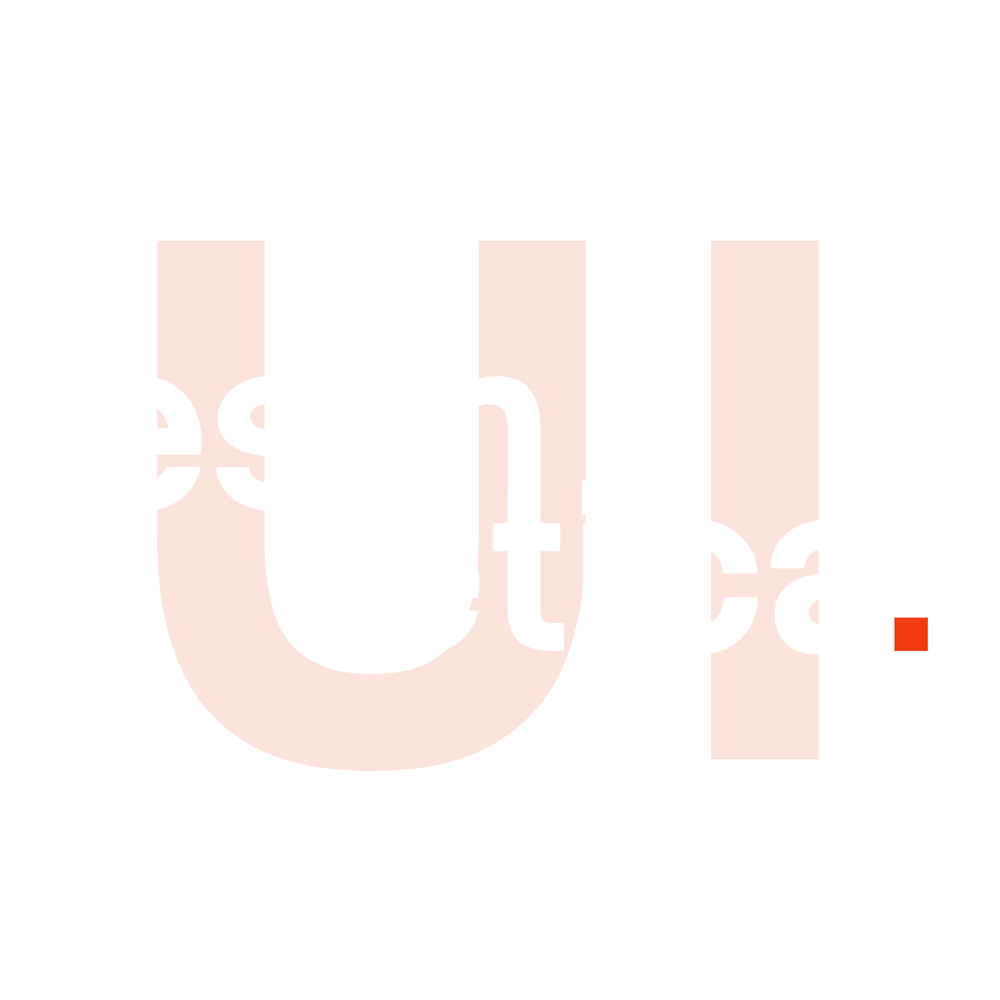

A minimalist Vue 3 component library built with TypeScript and UnoCSS.

## Requirements

- Node.js `^20.19.0` or `>=22.12.0`
- pnpm (recommended) or npm

## Installation

```sh
pnpm add esthetica-ui
# or
npm install esthetica-ui
```

Import the component styles in your entry file:

```ts
import 'esthetica-ui/style.css'
```

## Usage

```ts
import {
  EstAlert,
  EstButton,
  EstCard,
  EstInput,
  EstInputOTP,
  EstPagination,
  EstPasswordMeter,
  EstSkeleton,
  EstTable,
  EstToast,
} from 'esthetica-ui'
```

All component prop types are also exported:

```ts
import type {
  ButtonVariant,
  ButtonSize,
  ButtonType,
  ButtonProps,
  SkeletonRounded,
  SkeletonProps,
  CardVariant,
  CardProps,
  InputProps,
  InputOTPProps,
  AlertVariant,
  AlertProps,
  ToastVariant,
  ToastProps,
  PaginationProps,
  TableColumn,
  TableProps,
  PasswordMeterProps,
} from 'esthetica-ui'
```

## Components

| Component | Description |
|---|---|
| `EstAlert` | Contextual feedback messages with variants |
| `EstButton` | Button with variants, sizes, loading, and icon slot support |
| `EstCard` | Container card with variants |
| `EstInput` | Text input with label, helper text, and validation states |
| `EstInputOTP` | One-time password input |
| `EstPagination` | Page navigation control |
| `EstPasswordMeter` | Visual password strength indicator |
| `EstSkeleton` | Loading skeleton placeholder |
| `EstTable` | Data table with column definitions |
| `EstToast` | Transient notification message |

## Development

### Install dependencies

```sh
pnpm install
```

### Start the dev server

```sh
pnpm dev
```

The playground app runs at `http://localhost:5173`.

### Start Storybook

```sh
pnpm storybook
```

Storybook runs at `http://localhost:6006` and is the primary environment for developing and previewing components.

### Run unit tests

```sh
pnpm test:unit
```

Runs both jsdom unit tests and Storybook/Playwright browser tests.

Run a single test file:

```sh
pnpm vitest run src/__tests__/App.spec.ts
```

### Lint

```sh
pnpm lint
```

Runs `oxlint` followed by `eslint`, both with `--fix` applied automatically.

### Format

```sh
pnpm format
```

Formats all files under `src/` using `oxfmt`.

### Git hooks

This project uses [Husky](https://typicode.github.io/husky/) with [lint-staged](https://github.com/lint-staged/lint-staged) to enforce code quality on every commit. The pre-commit hook runs `lint-staged` automatically against **staged files only** under `src/`:

| Pattern | Tools |
|---|---|
| `*.{vue,ts,js,css}` | `oxfmt` (format) |
| `*.{vue,ts,js}` | `oxlint --fix`, `eslint --fix --cache` (lint) |

If the linter reports errors that cannot be auto-fixed, the commit is rejected. Stage any formatting changes produced by the hook and commit again.

Hooks are installed automatically when you run `pnpm install` via the `prepare` script.

## Build

### Build the library

```sh
pnpm build
```

Outputs an ES module (`esthetica-ui.js`), a UMD bundle (`esthetica-ui.umd.cjs`), a compiled CSS file (`esthetica-ui.css`), and TypeScript declarations to `dist/`.

### Build Storybook

```sh
pnpm build-storybook
```

### Preview the production build

```sh
pnpm preview
```

## Project structure

```
src/
  components/           # Vue components, scoped styles, and Storybook stories
    EstFoo.vue          # Component logic and template
    EstFoo.css          # Scoped styles (linked via <style scoped src>)
    EstFoo.stories.ts   # Storybook stories
  tokens/
    global.css          # Base tokens (--est-radius, --est-font-sans)
    colors.css          # Semantic color palette (--est-color-*)
    components/         # Per-component tokens (--est-foo-*)
  index.ts              # Library entry point — exports all components and types
  style.css             # Imports all token files; consumers import this once
```

## Design tokens

All design tokens are CSS custom properties under the `--est-` namespace and wrapped in `@layer estheticaui-tokens` so consumers can override them without specificity fights:

```css
:root {
  --est-radius: 0.5rem;
  --est-color-primary: …;
  /* override any token here */
}
```

Component tokens always reference global or color tokens via `var()` — never hardcoded values — so theming propagates automatically.

## License

ISC
